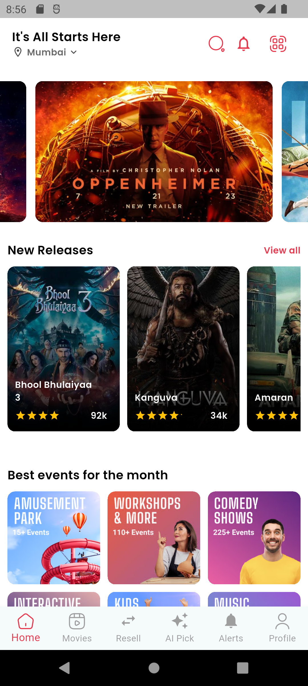
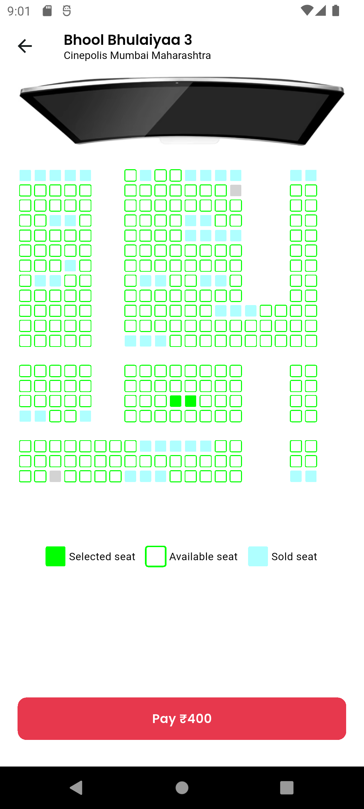
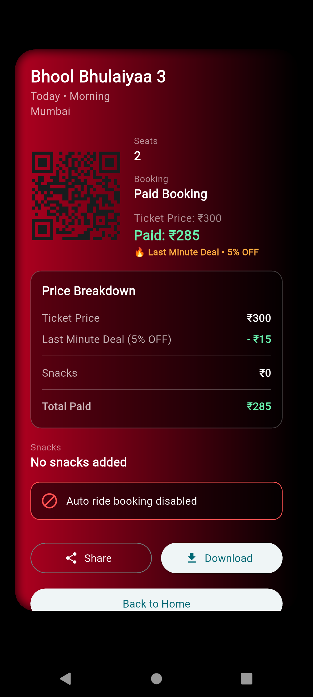
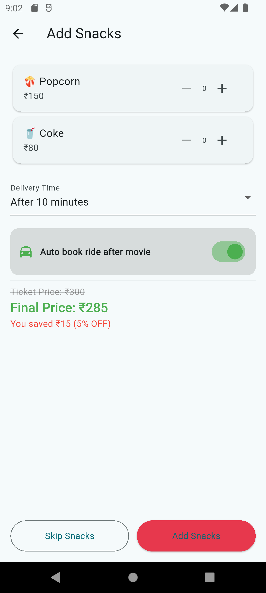

# 🎬 GrabUrTicket

A Flutter-based movie ticket booking application with Firebase integration, allowing users to book tickets, select seats, and order snacks seamlessly.

---

## 🚀 Features

- 🎟️ Movie ticket booking system  
- 🪑 Seat selection functionality  
- 🍿 Snack ordering feature  
- 🔐 User authentication using Firebase  
- 📱 Clean and responsive UI  
- 🔄 Real-time database integration  

---

## 🛠️ Tech Stack

- Flutter (Frontend)
- Firebase (Authentication, Firestore Database)
- Dart
- REST APIs

---

## 📸 Screenshots

<p align="center">
  
  
</p>

<p align="center">
  
  
</p>


---

## ⚙️ Installation

```bash
git clone https://github.com/amanpasi2005/GrabUrTicket.git
cd GrabUrTicket
flutter pub get
flutter run
